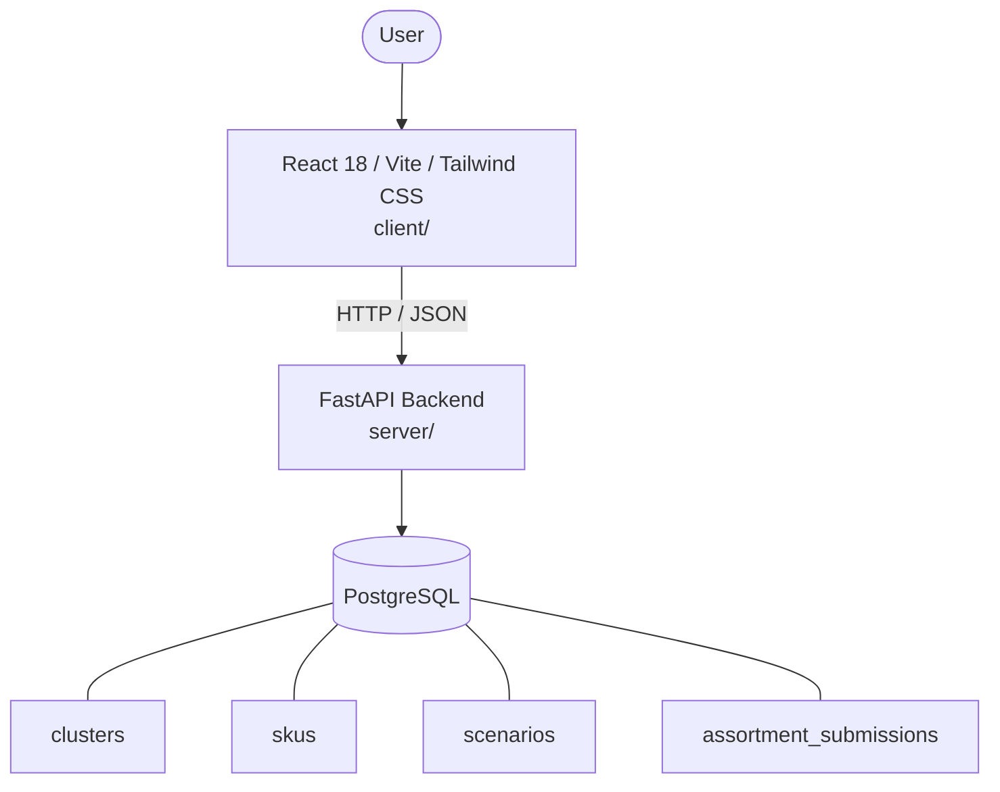

# Architecture

_Auto-generated by the SDLC Assistant from the generated codebase and the approved Feature Spec (latest: SCRUM-380). Regenerated on each push._

## System Diagram

## Tech Stack
- **language**: Python 3.11
- **backend_framework**: FastAPI
- **orm**: SQLAlchemy 2.x
- **database**: PostgreSQL
- **frontend**: React 18 / Vite / Tailwind CSS
- **cloud_provider**: GCP (Cloud Run, Cloud SQL)
- **constitution_section_4_followed**: True

## Backend Modules (server/)
- server/__init__.py
- server/database.py
- server/main.py
- server/models.py
- server/routers/__init__.py
- server/routers/clusters.py
- server/schemas.py
- server/services/__init__.py
- server/services/approval_service.py
- server/services/kpi_service.py
- server/services/scenario_service.py
- server/services/sku_service.py
- server/tests/__init__.py
- server/tests/conftest.py
- server/tests/test_clusters.py
- server/tests/test_kpis.py
- server/tests/test_scenarios.py
- server/tests/test_skus.py
- server/tests/test_submissions.py

## Frontend Modules (client/)
- (no client/ files found yet)

## API Endpoints
- GET /api/v1/clusters/{cluster_id}/kpis
- GET /api/v1/clusters/{cluster_id}/skus
- GET /api/v1/clusters/{cluster_id}/scenarios
- POST /api/v1/clusters/{cluster_id}/submissions

## Data Model
- clusters
- skus
- scenarios
- assortment_submissions
