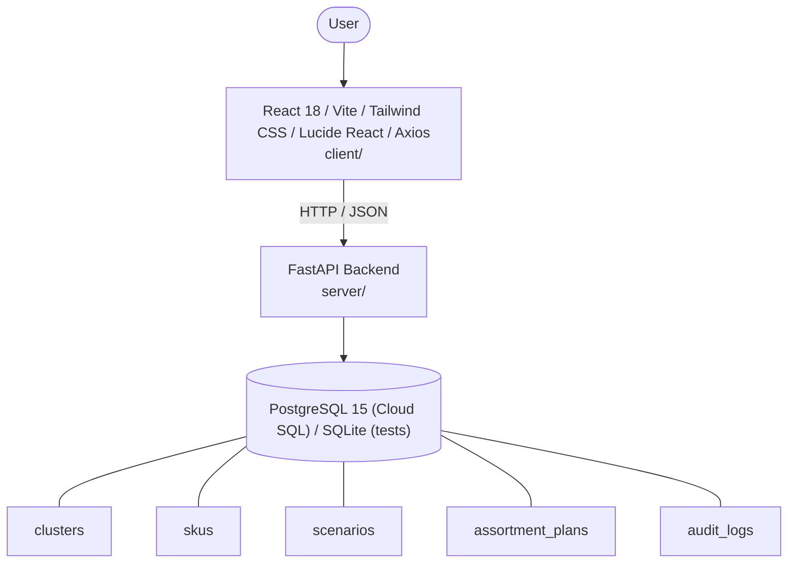

# Architecture

_Auto-generated by the SDLC Assistant from the generated codebase and the approved Feature Spec (latest: SCRUM-383). Regenerated on each push._

## System Diagram

## Tech Stack
- **language**: Python 3.11 / JavaScript (React 18)
- **backend_framework**: FastAPI
- **orm**: SQLAlchemy 2.x
- **database**: PostgreSQL 15 (Cloud SQL) / SQLite (tests)
- **frontend**: React 18 / Vite / Tailwind CSS / Lucide React / Axios
- **cloud_provider**: Google Cloud Platform (GCP - Cloud Run)
- **constitution_section_4_followed**: True

## Backend Modules (server/)
- server/__init__.py
- server/api/__init__.py
- server/api/v1/__init__.py
- server/api/v1/assortment.py
- server/api/v1/kpis.py
- server/api/v1/scenarios.py
- server/api/v1/skus.py
- server/database.py
- server/main.py
- server/models.py
- server/schemas.py
- server/seeds/__init__.py
- server/seeds/seed_data.py
- server/services/__init__.py
- server/services/guardrail_service.py
- server/tests/__init__.py
- server/tests/conftest.py
- server/tests/test_assortment.py
- server/tests/test_kpis.py
- server/tests/test_scenarios.py
- server/tests/test_skus.py

## Frontend Modules (client/)
- (no client/ files found yet)

## API Endpoints
- GET /api/v1/kpis/summary
- GET /api/v1/skus
- GET /api/v1/scenarios
- POST /api/v1/assortment/submit
- GET /api/v1/assortment/audit-logs

## Data Model
- clusters
- skus
- scenarios
- assortment_plans
- audit_logs
