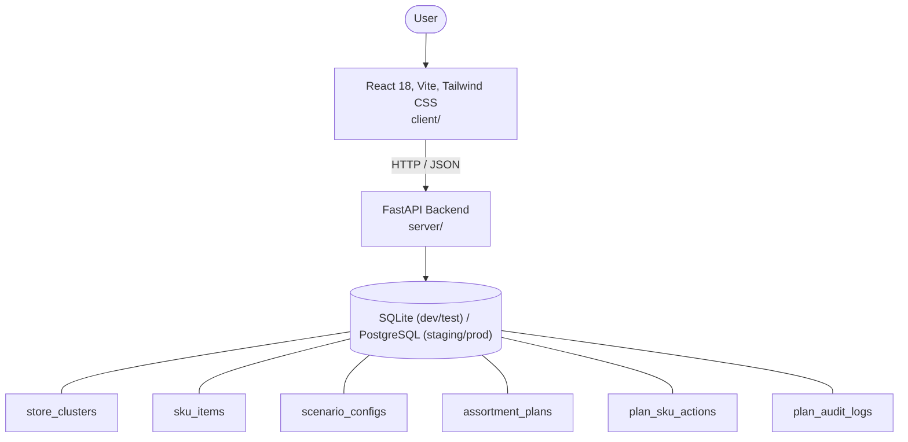

# Architecture

_Auto-generated by the SDLC Assistant from the generated codebase and the approved Feature Spec (latest: SCRUM-295). Regenerated on each push._

## System Diagram

## Tech Stack
- **language**: Python 3.11 / TypeScript/JavaScript
- **backend_framework**: FastAPI
- **orm**: SQLAlchemy 2.x
- **database**: SQLite (dev/test) / PostgreSQL (staging/prod)
- **frontend**: React 18, Vite, Tailwind CSS
- **cloud_provider**: GCP Cloud Run
- **constitution_section_4_followed**: True

## Backend Modules (server/)
- server/__init__.py
- server/database.py
- server/main.py
- server/models.py
- server/routers/__init__.py
- server/routers/kpi_router.py
- server/routers/plan_router.py
- server/routers/scenario_router.py
- server/routers/sku_router.py
- server/schemas.py
- server/services/__init__.py
- server/services/kpi_service.py
- server/services/plan_service.py
- server/services/scenario_service.py
- server/services/sku_service.py
- server/tests/__init__.py
- server/tests/conftest.py
- server/tests/test_kpis.py
- server/tests/test_plans.py
- server/tests/test_scenarios.py
- server/tests/test_skus.py

## Frontend Modules (client/)
- (no client/ files found yet)

## API Endpoints
- GET /api/v1/cluster/kpis
- GET /api/v1/skus
- GET /api/v1/scenarios
- POST /api/v1/scenarios/evaluate
- POST /api/v1/plans/submit
- GET /api/v1/plans/audit/{audit_id}

## Data Model
- store_clusters
- sku_items
- scenario_configs
- assortment_plans
- plan_sku_actions
- plan_audit_logs
