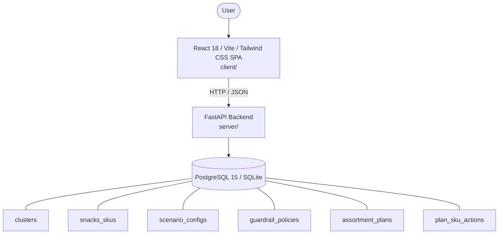

# Architecture

_Auto-generated by the SDLC Assistant from the generated codebase and the approved Feature Spec (latest: SCRUM-302). Regenerated on each push._

## System Diagram

## Tech Stack
- **language**: Python 3.11 / TypeScript
- **backend_framework**: FastAPI
- **orm**: SQLAlchemy 2.x
- **database**: PostgreSQL 15 / SQLite
- **frontend**: React 18 / Vite / Tailwind CSS SPA
- **cloud_provider**: GCP (Cloud Run, Cloud SQL, Artifact Registry)
- **constitution_section_4_followed**: True

## Backend Modules (server/)
- server/__init__.py
- server/config.py
- server/conftest.py
- server/database.py
- server/main.py
- server/models/__init__.py
- server/models/cluster.py
- server/models/guardrail.py
- server/models/plan.py
- server/models/scenario.py
- server/models/sku.py
- server/routers/__init__.py
- server/routers/kpi_router.py
- server/routers/plan_router.py
- server/routers/scenario_router.py
- server/routers/sku_router.py
- server/schemas/__init__.py
- server/schemas/guardrail.py
- server/schemas/kpi.py
- server/schemas/plan.py
- server/schemas/scenario.py
- server/schemas/sku.py
- server/seed.py
- server/services/__init__.py
- server/services/approval_service.py
- server/services/guardrail_service.py
- server/services/kpi_service.py
- server/services/scenario_service.py
- server/services/sku_service.py
- server/tests/__init__.py
- server/tests/test_kpis.py
- server/tests/test_plans.py
- server/tests/test_scenarios.py
- server/tests/test_skus.py

## Frontend Modules (client/)
- (no client/ files found yet)

## API Endpoints
- GET /api/v1/kpis
- GET /api/v1/skus
- GET /api/v1/scenarios
- POST /api/v1/scenarios/evaluate
- POST /api/v1/assortment-plans/submit
- GET /api/v1/assortment-plans/{audit_id}

## Data Model
- clusters
- snacks_skus
- scenario_configs
- guardrail_policies
- assortment_plans
- plan_sku_actions
